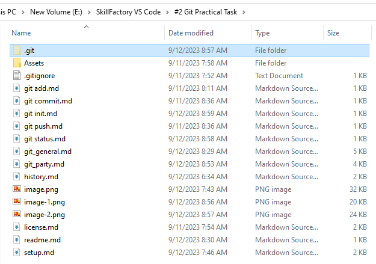

[< Назад](/git_general.md)

## git init

git init - Команда для инициализации локального репозитория. Без использования данной команды попросту невозможно взаимодействие с Git.

git init создает папку, локальный репозиторий, в каталоге проекта.

