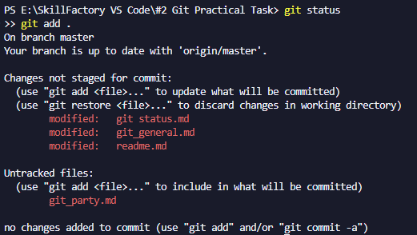
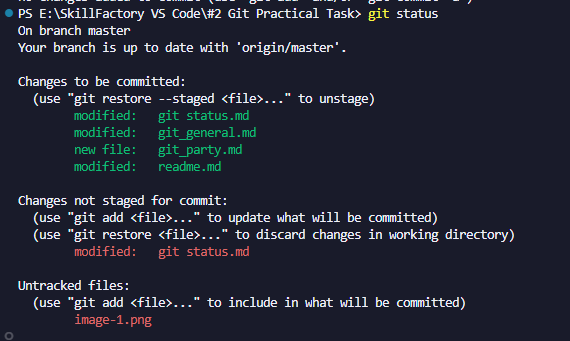

[< Назад](/git_general.md)

## git status

git status - Команда для просмотра статуса текущего репозитория. 

Невероятно полезная команда - позволяет следить за состоянием текущего коммита и не только! Статус очень подробно описывает текущие ошибки при работе с Git, что именно и с каким элементом неполадки. 

Рекомендуется пользоваться данной командой чаще, нежели реже. 

