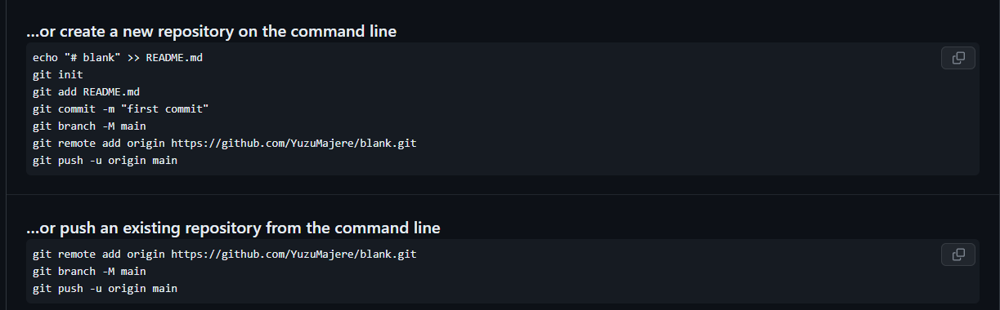

[< К содержанию](/readme.md)

## Работа с Git, GitHUB и консольные команды

Для начала Вам необходимо создать удаленный репозиторий на платформе GitHUB. 

Для создания репозитория на *GitHub* используйте кнопку «new» на главной странице или на странице со списком репозиториев.

Далее Вы увидите приведенный ниже список команд-подсказок. С этими командами мы и будем работать в дальнейшем.

Использовать Git можно множеством различных способов, и мы разбираем его на базе IDE ***"Visual Studio Code"***. Однако, данное руководство подойдет для любой другой IDE и/или среды разработки, т.к. все то же самое можно делать с помощью *Git GUI*, *Git BASH* и *Git CMD*.

1. В первую очередь Вам будет необходимо *инициализировать* локальный репозиторий с помощью команды ***[git init](/git%20init.md)***. Вводить данную команду мы будем в *Терминал/Terminal* VSCode. 

    Данная процедура инициализирует корневой каталог вашего проекта как локальный репозиторий, и теперь мы можем начать работус ним.

2. Следующая команда: "[git add ?](/git%20add.md)". Git add добавляет некоторые файлы в хеш для последующего *коммита*. С помощью нее можно добавть как **Все** файлы из проекта -- git add . -- так и конткретные файлы -- git add readme.md -- .

3. Для проверки состояния нашего взаимодействия с Git, существует команда **[git status](/git%20status.md)**. Довольно полезная команда для любых случаев.

4. Сейчас, когда мы добавили все или конкретные файлы, самое время создать наш первый *коммит* командой -- [git commit](/git%20commit.md) -m "name_of_your_commit" -- таким образом мы создаем *снимок* состояния нашего проекта в нашем локальном репозитории.

5. Здесь нам необходимо создать связь между нашим *локальным репозиторием* и *удаленным*. Сделаем мы это с помощью команды -- git remote add origin https://github.com/Your_Name/Name_Of_Your_Remote_Repository.git -- Данную ссылку мы возьмем из таблицы команд-подсказок, которую Вам выдали после создания репозитория на GitHub, или скопируйте ссылку на Ваш репозиторий на Github. 

    Аналогично команде "git add ?", "git add remote origin" создает удаленный репозиторий так же, как и локальный. Аттрибут "remote" означает "удаленный", а "origin" "исходный".

6. После создания связи с нашим удаленным репозиторием, необходимо отправить изменения, совершенные в нашем *локальном* репозитории. Сделаем мы это командой -- git push -- .

Таким образом мы создали **Удаленный репозиторий**; **Локальный репозиторий**, **Добавили** в него нужные нам файлы; сделали первый **Локальный коммит**; соединили наши **Удаленный и Локальный репозитории** и **Отправили изменения** на *Удаленный* репозиторий из *Локального*.